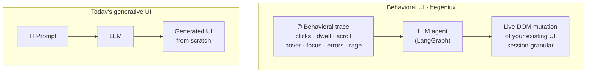
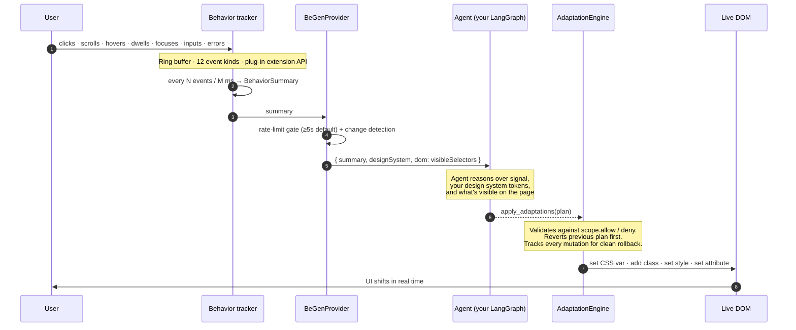
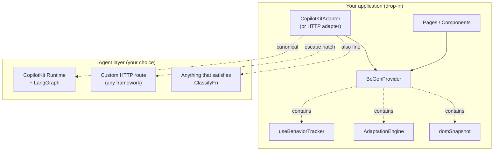

# begeniux

**Drop-in adaptive UI engine. Tracks user behavior, an agent decides a CSS-level adaptation plan, the live DOM mutates in real time.**

Today's UX cycle is slow: research → mock → ship → iterate. begeniux short-circuits it: install the library on an existing app, the agent observes how each user actually behaves, and the UI re-shapes itself live to match — accent colors, density, emphasis, microcopy. No variants pre-baked. No design committee. Personalization happens *during the session*.

## Install once, ship adaptive UI

```bash
npm install begeniux
```

That's it. begeniux ships **both** halves — the React side (provider + tracker + engine) and a server-side LangGraph.js agent that runs in your existing Node backend (Next.js API route, Hono, Express, Cloudflare Workers — wherever).

**Three lines of integration in any Next.js / Vite app:**

```tsx
// 1. app/api/begen/route.ts (Next.js API route)
import { createBeGenHandler } from "begeniux/server";
export const POST = createBeGenHandler({ apiKey: process.env.GEMINI_API_KEY! });

// 2. app/providers.tsx
"use client";
import { BeGenProvider, createHttpAdapter } from "begeniux";
const designSystem = { cssVariables: { "--accent": {...}, "--density": {...} }, classes: { ... } };
export function Providers({ children }) {
  return (
    <BeGenProvider designSystem={designSystem} pageContext={{ route: "/" }}
                   classify={createHttpAdapter({ url: "/api/begen" })}>
      {children}
    </BeGenProvider>
  );
}

// 3. add data-begen-id="..." to elements you want the agent to be able to target
```

Set `GEMINI_API_KEY` (or `ANTHROPIC_API_KEY`) and you're done. Behavior signals get captured, sent to the LangGraph agent server-side, the agent reasons over them with Gemini/Claude, and the DOM mutates live.

A complete runnable demo lives in [`examples/with-nextjs/`](./examples/with-nextjs/).

## Packaging

| Package | Where | When to use |
|---|---|---|
| **`begeniux`** (main) | npm | Always. Provider, tracker, engine, types, HTTP adapter. |
| **`begeniux/server`** | npm subpath | When you have a Node backend (Next.js / Vite + Express / Hono / Cloudflare). LangGraph.js agent. **The default canonical path.** |
| **`begeniux/copilotkit`** | npm subpath | When your stack already runs on CopilotKit Runtime (e.g. the hackathon stack). |
| **`begeniux-langgraph`** | PyPI · [`agent/`](./agent) | When your stack already runs on Python LangGraph (the hackathon's `apps/agent`). Reference Python implementation of the same agent — interchangeable with `begeniux/server`. |

For 90% of consumers, just `begeniux` + `begeniux/server` is the canonical setup. The other two are for when you're already invested in a specific agent stack and want to plug begeniux in without forklifting your runtime.

---

## Why behavioral UI?

### The UX cycle is slow

Every product UI ships the same way today:

1. Research, interviews, surveys
2. Mocks, design reviews, committees
3. Ship one UI to everyone
4. A/B test, iterate over weeks → months

This loop is slow because it optimizes the **average** user. Every individual gets the same UI. The signal you act on is aggregate; the time-to-respond is sprints. Power users wait through hand-holding they don't need; struggling users churn before help arrives.

### Behavioral UI flips it

Drop begeniux into your existing app and the loop becomes:

1. The library tracks **any** user behavior — clicks, dwell, scroll, hovers, focus, form interactions, errors, rage clicks, custom events
2. A LangGraph agent (running OpenAI / Gemini / Claude — your pick) reasons over the signal in real time
3. The UI re-shapes itself live — density, accent color, microcopy, emphasis — within the **design system you declare**
4. Each user sees a UI tuned to them, evolving across the session

Personalization happens **during the session**, not in the next sprint. No variants to pre-build. No design committee. No statistical significance to wait for.

### What makes "behavioral" the right word

We picked the term deliberately. Adjacent framings each miss something:

| Term | What it implies | Why it's wrong here |
|---|---|---|
| Adaptive UI | Conflates rule-based and ML systems; academic baggage from the SUPPLE era | Doesn't name the input modality |
| Generative UI | Implies the LLM generates UI from scratch (Vercel AI SDK style) | Assumes prompt-driven, not observation-driven |
| Agentic UI | Names the policy but not what feeds it | Doesn't tell you the input is *behavior* |

**Behavioral UI** is precise: the input is observed user behavior — the cheapest, most honest signal a digital product has. Until LLMs, nobody could read it well enough to act on it in real time.

### Why now

Adaptive-UI research is 30+ years old. SUPPLE (2004) showed UIs could regenerate per user. Contextual bandits (2010) showed online learning could pick layouts. Implicit-feedback work (2005) showed clicks already encode preference. None of this shipped at scale because:

- **Hand-coded rules** couldn't keep up with combinatorics
- **Shallow ML** needed massive population traffic to converge — too slow for one session
- **A/B tests** optimize populations, not individuals — the wrong granularity

In-context learning (GPT-3 onward) cracked it. An LLM can reason from a handful of behavioral signals to a sensible UI choice **without training, without traffic, in one session**. That's the unlock.

### The five pieces, combined



The contribution is the **combination of five ideas** that have not been combined in production before:

1. **Interaction traces as the input modality** (not text prompts)
2. **LLM agents as the policy** (not hand-coded rules, not shallow classifiers)
3. **Session-granularity adaptation** (not population-level A/B)
4. **Mutation of the existing UI** (not replacement of pre-built variants — drop-in install)
5. **Developer-declared design-system invariants** (the agent is bounded — it can only speak the vocabulary of CSS variables and classes you expose)

The first three are 2024+ technology. The fourth is what makes it drop-in. The fifth is what makes it safe.

### The runnable proof

[`examples/with-nextjs/`](./examples/with-nextjs/) is a tiny e-commerce surface where you can watch all of this fire end-to-end: search, hover, rage-click — the agent reasons over the trace, calls `apply_adaptations`, and the UI density / accent / emphasis shifts in real time. The sticky telemetry strip at the bottom shows you exactly what the agent decided and why, every time it runs.

---

## How it works



Three things keep this honest:

1. **Listeners scoped to the provider's container** (default `document.body`). Universal coverage, opt-in narrower scope via `containerRef`.
2. **CSS-only mutations.** No `display`, no `position`, no structural reshuffles in v0.2 — the engine refuses them. Layout cannot break.
3. **Plan-level reversibility.** Every new plan reverts the previous one before applying. Mutations never accumulate. Provider unmount restores the page completely.

---

## Where it fits in your stack



The library has **zero opinions** about your agent backend. CopilotKit + LangGraph + Gemini is the canonical hackathon stack and the easiest path; the HTTP adapter and the `useBehaviorTracker` / `AdaptationEngine` escape hatches let you wire anything else.

Peer-deps: `react`, `react-dom` (>=18). `@copilotkit/react-core` and `zod` are **optional** peers, only needed if you import the CopilotKit adapter.

---

## The contract

Three types are the entire boundary between your code and the library:

```ts
type ClassifyFn<TContext = { route: string }> =
  (input: AdaptInput<TContext>) => Promise<AdaptationPlan>;

type AdaptInput<TContext> = {
  summary: BehaviorSummary<TContext>;     // 12 event kinds, aggregated
  designSystem: DesignSystem;             // your vocabulary (CSS vars + classes)
  dom: { visibleSelectors: string[]; route: string };  // what's on screen
};

type AdaptationPlan = {
  adaptations: Adaptation[];
  confidence: number;     // 0..1; engine skips below threshold
  reasoning: string;
};

type Adaptation =
  | { kind: "set-css-var"; selector: string; name: string; value: string }
  | { kind: "add-class"; selector: string; className: string }
  | { kind: "remove-class"; selector: string; className: string }
  | { kind: "set-style"; selector: string; property: string; value: string }
  | { kind: "set-attribute"; selector: string; name: string; value: string }
  | { kind: "set-aria-label"; selector: string; value: string };
```

The full type contract — including `BehaviorSummary`, `DesignSystem`, `BeGenProviderProps` — lives in [`src/types.ts`](./src/types.ts).

---

## Quick start (CopilotKit + LangGraph)

The canonical wiring. See [`examples/with-copilotkit/`](./examples/with-copilotkit/README.md) for the full snippet, including the LangGraph node side.

```tsx
import { CopilotKitProvider } from "@copilotkit/react-core/v2";
import { BeGenProvider, type DesignSystem } from "begeniux";
import { CopilotKitAdapter } from "begeniux/copilotkit";

const designSystem: DesignSystem = {
  cssVariables: {
    "--accent": { description: "Action color", type: "color", defaultValue: "#7c3aed" },
    "--density": { description: "Layout density", type: "length", defaultValue: "16px" },
  },
  classes: {
    "is-engaged": "High-engagement treatment",
    "is-skimming": "Low-engagement treatment",
  },
};

export default function App() {
  return (
    <CopilotKitProvider runtimeUrl="/api/copilotkit">
      <BeGenProvider designSystem={designSystem} pageContext={{ route: "/" }}>
        <CopilotKitAdapter />
        <YourApp />
      </BeGenProvider>
    </CopilotKitProvider>
  );
}
```

The agent gets a frontend tool called `apply_adaptations`. Whenever it decides the UI should change, it calls the tool — begeniux applies the plan, the DOM shifts, the user sees a different UI without a reload.

---

## Quick start (HTTP — any backend)

Don't use CopilotKit? Wire any HTTP endpoint:

```tsx
import { BeGenProvider, createHttpAdapter } from "begeniux";

const classify = createHttpAdapter({
  url: "/api/begen/adapt",   // your endpoint
  // POST { summary, designSystem, dom } → { adaptations, confidence, reasoning }
});

<BeGenProvider designSystem={designSystem} pageContext={{ route: "/" }} classify={classify}>
  <YourApp />
</BeGenProvider>
```

Your endpoint can call Gemini, Claude, OpenAI, a Python service, anything. You shape the response into `AdaptationPlan` and the library handles the rest.

---

## Quick start (no agent — heuristic / offline / demo)

Pass a function inline. No network, no LLM. Useful for demos, tests, offline dev:

```tsx
const classify: ClassifyFn = async ({ summary }) => {
  const engaged = summary.clicks_per_min > 6;
  return {
    adaptations: [
      {
        kind: "set-css-var",
        selector: ":root",
        name: "--accent",
        value: engaged ? "#dc2626" : "#2563eb",
      },
    ],
    confidence: 0.8,
    reasoning: engaged ? "Fast pace" : "Calm pace",
  };
};
```

See [`examples/basic/`](./examples/basic/) for a complete runnable demo using this pattern.

---

## Reading state from children

```tsx
import { useBeGenContext } from "begeniux";

function Telemetry() {
  const { summary, lastPlan, appliedAdaptations } = useBeGenContext();
  return (
    <pre>
      events: {summary?.events_seen} ·
      clicks/min: {summary?.clicks_per_min} ·
      reasoning: {lastPlan?.reasoning} ·
      mutations: {appliedAdaptations.length}
    </pre>
  );
}
```

Use it for debug overlays, telemetry strips, analytics pipelines, or to make components react to the agent's reasoning.

---

## API surface

| Export | What it does |
|---|---|
| Export | Where | What it does |
|---|---|---|
| `<BeGenProvider>` | `begeniux` | The provider. Tracks behavior, holds the engine, gates triggers, runs `classify`, exposes context. Drop-in. |
| `useBeGenContext()` | `begeniux` | Read the latest summary, last plan, applied adaptations, plus an `applyPlan(plan)` escape hatch. |
| `createHttpAdapter(opts)` | `begeniux` | Returns a `ClassifyFn` that posts the `AdaptInput` to your URL. Generic transport. |
| `useBehaviorTracker(opts)` | `begeniux` | Low-level hook used by the provider. Reach for it if you need a tracker outside a provider context. |
| `AdaptationEngine` | `begeniux` | Low-level class. Apply, revert, query mutations directly if you don't want a provider at all. |
| `snapshotVisibleSelectors(root, opts)` | `begeniux` | Returns a list of stable CSS selectors visible in the viewport. Useful when building your own classify fn. |
| `<CopilotKitAdapter />` | `begeniux/copilotkit` | Mount inside `<BeGenProvider>` to register `apply_adaptations` as a CopilotKit frontend tool. |
| `useCopilotKitAdapter(opts)` | `begeniux/copilotkit` | Hook variant of `<CopilotKitAdapter />`. |

The `/copilotkit` subpath is split out so consumers who don't use CopilotKit don't pull `@copilotkit/react-core` (and its transitive deps like KaTeX) into their bundle.

All exports are documented in [`src/index.ts`](./src/index.ts).

---

## What goes in the design system

The design system is the **vocabulary the agent is allowed to speak**. Two tiers:

```ts
const designSystem: DesignSystem = {
  cssVariables: {
    "--accent": { description: "Action color", type: "color", defaultValue: "#7c3aed" },
    "--density": { description: "Layout density", type: "length", defaultValue: "16px" },
    "--font-scale": {
      description: "Font multiplier",
      type: "number",
      range: [0.8, 1.4],
      defaultValue: "1",
    },
    "--surface-emphasis": {
      description: "Which surface gets visual emphasis",
      type: "enum",
      values: ["price", "reviews", "imagery", "specs"],
      defaultValue: "price",
    },
  },
  classes: {
    "is-engaged": "Visual treatment for engaged users",
    "is-skimming": "Visual treatment for low-engagement",
    "is-cta-prominent": "Boost CTA emphasis",
  },
  examples: [
    {
      adaptations: [
        { kind: "set-css-var", selector: ":root", name: "--density", value: "10px" },
      ],
      confidence: 0.85,
      reasoning: "Compact dense view for engaged user.",
    },
  ],
};
```

The agent receives this manifest as part of every `AdaptInput`, so it knows exactly which knobs are turnable and what each means. **Anything not declared here is invisible to the agent.** That's your safety net.

---

## Safety + scope

By default the provider tracks behavior on `document.body` and the agent can target any selector under it. You can narrow:

```tsx
<BeGenProvider
  designSystem={designSystem}
  pageContext={{ route: "/" }}
  scope={{
    allow: ["[data-begen-adapt]", ".product-card", ":root"],
    deny: ["[data-checkout]", ".payment-form"],
  }}
>
```

`scope.deny` is a hard veto — the engine refuses any adaptation whose selector matches a deny pattern. Use it to protect critical paths.

CSS-only invariants in v0.2:

- The engine refuses `set-style` for `display`, `position`, `visibility`, `float`, `clear`, `z-index`, `overflow*`, `transform-origin`. Use CSS variables and classes instead.
- The engine reverts every previous plan before applying a new one — mutations never accumulate.
- On unmount, every applied mutation is reverted. The page is restored.
- Identical consecutive plans are skipped (cheap deterministic hash).
- Empty plans are no-ops.

---

## Local development

```bash
git clone https://github.com/WagnerAgent/BeGeniux
cd BeGeniux
npm install
npm run build              # one-shot build → dist/
npm run dev                # tsup --watch

# Smoke test
cd examples/basic
npm install
npm run dev                # http://localhost:5180
```

The example imports from `../../src/index.ts` via a Vite alias, so source changes hot-reload. No CopilotKit / LangGraph / API keys needed — the example uses an inline mock classifier.

---

## Migrating from v0.1

v0.1 was a variant-picker — you handed the library `{decisive, deliberate, neutral}` components and an LLM picked one. v0.2 deletes that model entirely:

- `BeGenSurface` → removed. `BeGenProvider` is now the entire library entrypoint.
- `Variant` / `AgentDirective` → removed. `AdaptationPlan` is what the agent returns.
- `createGeminiClassifier` → removed. Browser-side LLM calls were the wrong shape; use the CopilotKit adapter or a server-side HTTP endpoint.
- `createHeuristicClassifier` → removed. It's a 5-line `ClassifyFn` if you still want one.
- `PERSONAS` → removed. `seedTrace` on the provider takes any `BehaviorEvent[]`; bring your own.

If you've already integrated v0.1, stay on v0.1.x — it's still on npm. Upgrade to v0.2 when you're ready to switch from variant-picking to live adaptation.

---

## Research lineages

- **Adaptive UIs** — Gajos & Weld, *SUPPLE: Automatically Generating User Interfaces* (IUI 2004)
- **Contextual bandits** — Li et al., *A Contextual-Bandit Approach to Personalized News Article Recommendation* (WWW 2010)
- **Implicit feedback** — Joachims et al., *Accurately Interpreting Clickthrough Data as Implicit Feedback* (SIGIR 2005)
- **In-context learning as policy** — Brown et al., *Language Models are Few-Shot Learners* (NeurIPS 2020)

The novel contribution is the combination: behavioral traces as input, LLM agents as policy, session-granularity adaptation, **live DOM mutation** as output, with developer-declared design-system invariants.

---

## Roadmap

- **v0.3** — Tool-calling agent loop (agent inspects DOM iteratively); structural mutations (insert, reorder, hide/show under invariant constraints); streaming AdaptationPlan events.
- **v0.4** — Component replacement primitive; an invariant DSL ("checkout always reachable in ≤2 clicks"); replay traces + counterfactual scoring.
- **v0.5** — Cross-session memory (with explicit consent); behavioral embeddings; multi-armed bandit policies as a non-LLM fallback.

---

## Contributing

PRs welcome. Keep the public API minimal — anything not exported from `src/index.ts` is internal. Don't bundle React or CopilotKit. Don't assume Next.js. The library should drop into Vite, CRA, Remix, Next, or anywhere React 18+ runs.

If you're working in this repo with Claude Code (or another agent), the [`.claude/skills/`](./.claude/) directory has prebaked domain knowledge about CopilotKit, AG-UI, MCP, and LangGraph integrations — read the relevant `SKILL.md` before touching adapter code.

## License

MIT — see [LICENSE](./LICENSE).
